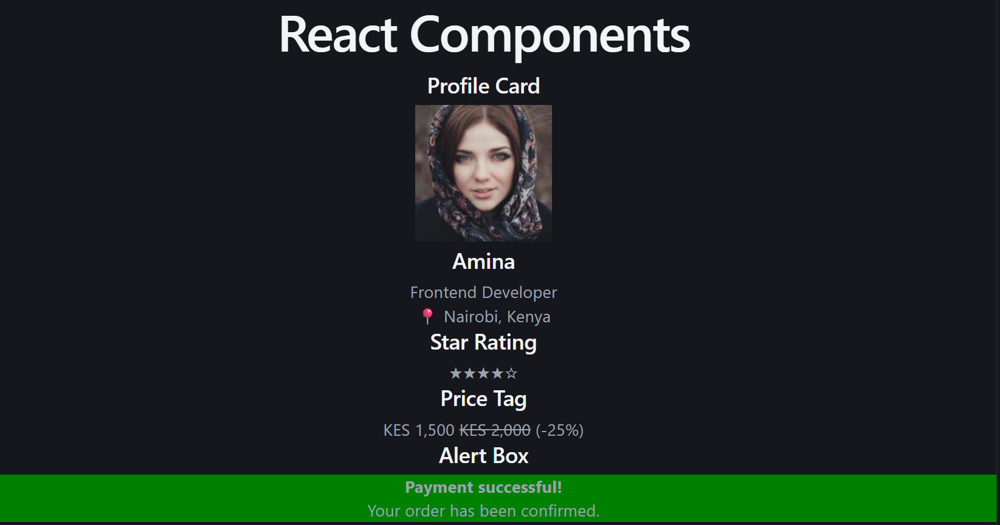
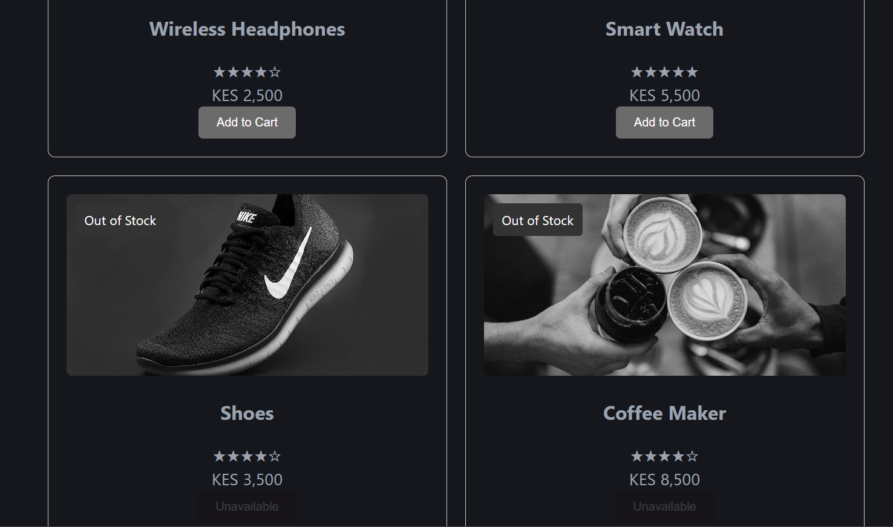

# React Component Exercises

## Overview

This project contains three React exercises built with Vite. 

## Technologies Used

- JavaScript
- React
- JSX
- Vite
- CSS
- ESLint
- Node.js
- npm

## Features

### Task 1: Reusable React Components

- `ProfileCard` displays an avatar, name, title, and location.
- `StarRating` displays filled and empty stars based on a rating.
- `PriceTag` displays a formatted price, currency, and optional discount.
- `AlertBox` displays success, warning, or error messages.
- `NavBar` displays a brand name and navigation links.
- Components receive data through props.
- Each component is stored in its own file inside `src/components/`.


### Task 2: ProductCard

- Displays a product image, name, price, and star rating.
- Reuses the `StarRating` component from Task 1.
- Formats prices with commas, such as `KES 4,500`.
- Uses conditional rendering based on the `inStock` prop.
- Displays an `Add to Cart` button for products that are in stock.
- Displays a disabled `Unavailable` button for out-of-stock products.
- Applies a grayscale filter to out-of-stock product images.
- Displays an `Out of Stock` badge for unavailable products.
- Renders multiple product cards using the same reusable component.


### Task 3: TeamPage

- `TeamPage` receives a `members` array through props.
- `MemberCard` displays a member's avatar, name, role, and bio.
- Uses `.map()` to render multiple team members dynamically.
- Uses the spread operator (`{...member}`) to pass member properties as props.
- Uses React's `key` prop when rendering a list.
- Dynamically displays the total number of team members.
- Includes six Kenyan team members as sample data.
- Displays the members in a CSS grid.


## React Concepts Practiced

- Functional components
- JSX
- Props
- Props destructuring
- Component reuse
- Conditional rendering
- Ternary operators
- Logical `&&` rendering
- Inline styles
- Arrays and objects
- `.map()` for rendering lists
- Spread operator
- React `key` prop
- Dynamic values using `.length`
- CSS Grid
- Component organization

## Project Structure

```text
src/
├── components/
│   ├── ProfileCard.jsx
│   ├── StarRating.jsx
│   ├── PriceTag.jsx
│   ├── AlertBox.jsx
│   ├── NavBar.jsx
│   ├── ProductCard.jsx
│   ├── MemberCard.jsx
│   └── TeamPage.jsx
├── App.jsx
├── App.css
├── index.css
└── main.jsx